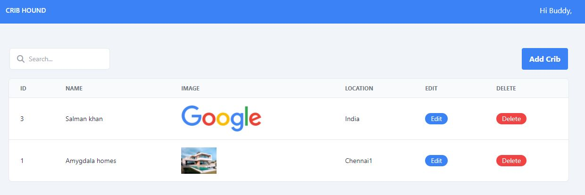
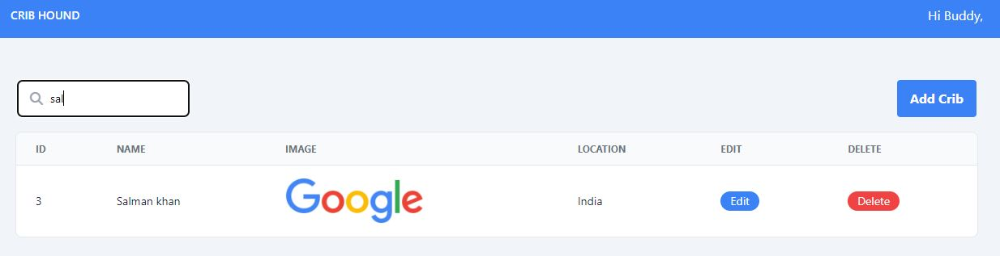
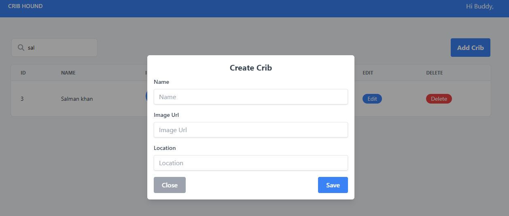
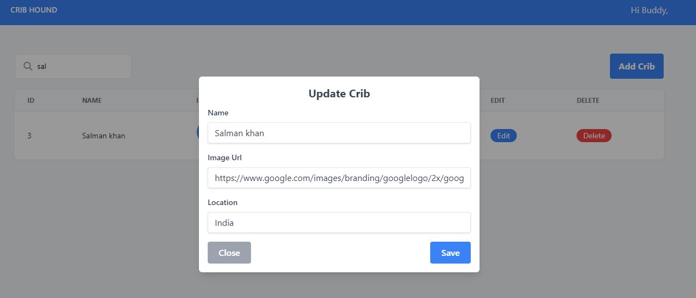

# Crib Hound

## Frontend - React, Typescript, Tailwind css

1. Clone this repository.
2. Check `.env` and update the Base api url.
3. Run `npm install` to install the dependencies.
4. Run `npm start`
5. Run `npm run watch:css` to update the css from the tailwind

## Backend - Nest JS [Rest API]

1. Clone this repository.
2. Run `npm install` to install the dependencies.
3. Run `npm start`

## Database [default setup] - MYSQL

### File Path: src/config

```
type: 'mysql',
host: 'localhost',
port: 3306,
username: 'root',
password: '',
database: 'crib_hound',
```

## Screenshots

### Get Cribs Screen



### Search Cribs Screen



### Add Crib Popup



### Update Crib Popup


